# MNT VA2000, an Amiga 2000 Graphics Card (Zorro II)

This repository contains my Kicad schematics and Xilinx ISE/Verilog files for my graphics card project. This is a work in progress, started in October 2015. The first 4 prototypes were assembled in Jan/Feb 2016 and had noise problems, so I started a redesign on Feb 13, 2016.

On Mar 27th, 2016, the redesign worked and I could load a 16 bit 565BGR coded raw image from floppy into the graphics card that displayed a 1280x720p resolution (75mhz pixelclock).

In April 2016, I managed to get Workbench running via a reverse engineered Picasso96 driver.

The working Xilinx project for the new target platform (Scarab miniSpartan 6+) is now in the z2-minispartan folder. The main source file is: https://github.com/mntmn/amiga2000-gfxcard/blob/master/z2-minispartan/z2.v

Contains a modified SDRAM controller (Verilog) and a DVI encoder (VHDL) by Mike Field. See credits and license at the end.

# How I decided to make a graphics card for my Amiga 2000

_TL;DR: I spent my free time over the course of 5 months to make two open source graphics card prototypes for the Amiga 2000. I will make a third, release version; details at the end._

Somewhere in the middle of 2015 I revived my old A500 and acquired again an A1200. Using the A1200, I learned C++ and the basics of web programming in the late 90s. I also used to play many fantastic Amiga games back in the day, made my first music in ProTracker and my first digital graphics in Deluxe Paint. Re-experiencing the old system that was once so ahead of its time again made me curious about Commodore's history – and especially about the later, big and ambitious Amiga models (A3000, A4000…). This coincided with Amiga's 30th anniversary. A lot of new interviews with the original team(s) popped up, including Dave Haynie, who was a main designer of the A2000 and the Zorro III Bus.

I checked eBay for the "big" Amigas I never had, expecting them to be cheap, but found out that these boxes had turned into valuable collector's items. At the same time, A2000s were (and still are) affordable, so I chose to get one and put a 68040 and a SCSI card in it. But the system couldn't realize it's full potential; in the 90s you could already get, for example, a "Picasso" graphics card that could do VGA (and higher) resolutions at 16 or 24bit color depth. Nowadays, these totally outdated cards are rare and sold for ridiculous prices. My A2000 was stuck with 640x256 PAL resolution, 64 colors (ignoring HAM) or headache-inducing interlaced modes. 

Because of my work with microcontrollers, writing an OS for Raspberry Pi (http://interim.mntmn.com/) and my interest in low-level computer architectures in general, I decided in October 2015 in a feat of madness: "I'll just make my own graphics card. How hard can it be?"

It turned out to be a very, very challenging project, but luckily I got much further than expected. On the way, I had to learn how to design a PCB and get it manufactured, how to work with SMD parts, how to program in Verilog and synthesize code for an FPGA, how SDRAM and DVI/HDMI work (or how to get them to do at least something). I also had to find out how to write a driver for the sadly closed/undocumented Picasso96 "retargetable" graphics stack for AmigaOS 3.

The Amiga is probably the last 32-bit personal computer that is fully understood, documented and hackable. Both its hardware and software contain many gems of engineering and design. I hope that one day, we can have a simple but powerful modern computer that is at the same time as hackable and friendly as the Amiga was.

## The "engine": FPGA and SDRAM

As a platform for my first attempt (ultimately a failure) I chose the Papilio Pro development board, which has a Xilinx Spartan 6 FPGA and a few megabytes of SDRAM connected to it. It also has two pin headers that break out some of the general purpose input/output pins of the Spartan. I thought, OK – I could use the RAM to store the image (a framebuffer), and run a loop that goes through all the columns and rows of the picture in the correct speed and just output the bytes from the RAM to R,G and B output lines. I did this before with little Atmel microcontrollers – "bit-banging" a VGA image directly from the CPU – so I knew it was possible. I just didn't know that SDRAM (synchronous dynamic RAM) was a lot more complex to use than the integrated SRAM (static RAM) of common microcontrollers. To access data in a dynamic ram, you have to open banks, rows, precharge, refresh, and take care of startup and access delays:

Source: http://www.alliancememory.com/pdf/dram/256m-as4c16m16s.pdf

Mike Field's open source SDRAM controller written in VHDL and Verilog helped me get the RAM working. I connected an Arduino to the Papilio and used it to send a few address bits and an "on/off" bit to toggle pixels in the framebuffer black or white. This contraption was able to draw basic fonts on my VGA display, and they were successfully kept in the SDRAM. 

The next step was connecting the FPGA+display part to the Amiga 2000.

## Zorro II: Reads and Writes

The original Amiga Hardware Manuals helped me understand the Zorro II bus. It is basically an extension (arbitrated by a bus controller chip) of the pins of the Motorola 68000 CPU. The 68k is extensively studied and documented. I understood that I needed a mechanism that would allow the 68k CPU to write data (pixels) to the graphics card's RAM and another for reading back parts of the screen (for scrolling and moving around things).

So I fired up the open source circuit design tool KiCad and started some schematics. The first task was to define the Zorro port as a component with a whopping 100 pins. Of course I made a lot of little mistakes at first and I had no idea why one would need so many different signals. It turned out that I only needed a subset of the pins to get my job done:

1. Address Bus (A1-A23)
2. Data Bus (D0-D15)
3. Upper and Lower "Data Strobes" (UDS / LDS)
4. READ, /AS, DOE, signals which the Amiga uses to communicate if it wants to read or write, if it presents a valid address and if it expects a device to send data.
5. Power (5V, GND)
6. Autoconf (/CFGIN, /CFGOUT)

Source: http://courses.cs.tamu.edu/cpsc462/walker/Slides/68K_Timing_Diagrams.pdf

I figured that I needed to connect most of these signals to the FPGA and then write another loop in Verilog that would interpret the Amiga's bus commands and act on them (store the data given on the bus in the RAM or return stuff from the RAM). 

On the other side of the FPGA, I decided to place an Analog Devices ADV7125 digital to analog converter (DAC) chip that would generate the analog R, G and B channels for the VGA port from the bits coming from the framebuffer.

Source: http://www.analog.com/media/en/technical-documentation/data-sheets/ADV7125.pdf

The next hurdle appeared: The Spartan communicate with modern 3.3V logic levels, but the Amiga used legacy 5V signals. So I needed to put voltage translators (also called level shifters) between the Zorro and the FPGA pins. I decided to split the signals into bundles of 8 and use six 8-bit "auto-direction-sensing" TXS0108 chips.

Source: http://www.ti.com/lit/ds/symlink/txs0108e.pdf

## Mistake: Trying to be too smart

I then realized that the Papilio, the FPGA board I had, didn't have enough I/O pins to connect to the 48 Zorro signals and the 16+2 pins required for the VGA DAC output. Actually, it had a lot less pins. So I made a huge mistake and decided to use two 16-bit port switching chips and "select" on the fly a "window" of the Zorro pins that would be relevant at each state of my bus communication loop; I thought I didn't need to access the data pins at the same time as the address pins. And because the FPGA runs at a much higher frequency than the Zorro bus, I could first read one part of the address, switch one of the switches via a control pin and then quickly read the other part to get the whole address.

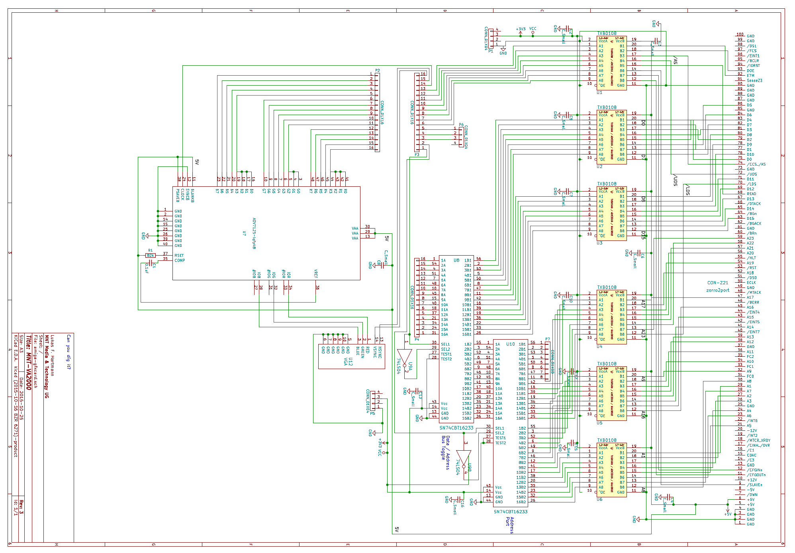 

After drawing up a few versions of the schematics and collecting the fitting footprints for the components from various GitHub repositories, I imported them into KiCad's PCB design tool and started drawing the actual circuit board. I had no experience doing this, so I worked through tutorials or just looked at how other people were solving their board design problems. Finally, I uploaded the exported "Gerber" files to DirtyPCBs.com, ordered, waited 8 weeks and nothing happened. I made the mistake of choosing the AirMail option, which has no tracking, and the package was lost. After getting no support from DirtyPCB, I chose to try again, this time selecting the DHL option with tracking and finally got my first ever printed circuit boards in the mail around 10 days later! By now, it was the middle of January 2016.

In parallel, I ordered the required chips and parts from Mouser; luckily I had gotten most of the footprints right, except for one logic gate IC that turned out to be a mistake anyway. I got to work and tried to solder my first SMD ICs using my trusted ERSA iron. 

 

It turned out I had made a number of critical mistakes in designing the boards: all of the voltage translators' OE pins were tied to GND when they should have had 3.3V, so they required manual bending and patching of the OE leg (yellow cables in the picture). I accidentally switched 3.3V and GND pins on the FPGA carrier headers, so I needed to reroute them with wires on the back. Because I misinterpreted the Multiplexer IC's datasheet, I also planned for a negating logic IC on their SEL pins which was totaly wrong. In the end I had to solder bridges instead of placing the 74LS04. 

After fighting through all of these issues and burning through a few boards, I finally gut some results. As a first debugging step, I wrote a poor man's logic analyzer in Verilog that would record 640 cycles of all the Zorro Bus signals to FPGA registers (BRAM) and dump them as colorful lines on the VGA screen. This turned out to be a helpful instrument. I wrote a very simple program in 68k assembler for the Amiga that would read – in an endless loop – a word from address $e80000 and write it to $dff180 (a background color register). I made a boot floppy that would run the program, put my card in the A2000, flashed the code and turned everything on.

 

The first 5 longer, stretched rows in this picture are the signals DOE, READ, /UDS, /AS and E7M (Amiga 7Mhz Clock) sampled at 100 Mhz/Column, so the whole picture displays a time sample of 6400ns (nanoseconds) or 6.4&mu;s (microseconds).

The following lines on the grid represent the Address bits A23-A1 in descending order. A0 does not exist; the 68000 selects an upper, lower or both bytes (word access) using /UDS and /LDS instead.

The address signals have regular little chops in them; this is a nasty side effect of switching the multiplexers. You can also see that address bit A9 is constantly turned on, probably due to a soldering error. At least it's possible to see the 68000's read and subsequent write accesses (the only hole in the READ row, second from the top). Ignoring the broken pins A9 and A17, the READ occurs as expected on address binary 111010000000000000000000 and the WRITE on 0b110111111111000110000000. Due to the constant noise and other random failures, I couldn't reliably get the Amiga to read from my card, but it worked at least sometimes, giving me hope.

After a few nights of trying to fix this very unstable system, I gave up and went back to the drawing board.

## Redesign and Breakthrough

My new strategy was:
1. Make the board much simpler, focus on voltage translation and find a FPGA board with enough IOs
2. Get a decent (de-)soldering station and learn a better SMD soldering technique

I shopped around the web for FPGA boards that combine SDRAM with lots of IO breakouts and found Scarab Hardware's miniSpartan6+, which has a nice small formfactor and includes two HDMI ports, a mini SD card reader and even an audio jack. Sadly, as of this writing, Scarab Hardware has disappeared from the web; waiting for my board to arrive took several months. For the final version, I plan to switch to the even more powerful Numato Labs Saturn.

I redrew the schematics to include no more switches, different level shifters with explicit direction inputs (NXP 74LVC8T245), plenty of bypass capacitors and dropped the analog VGA circuit. 

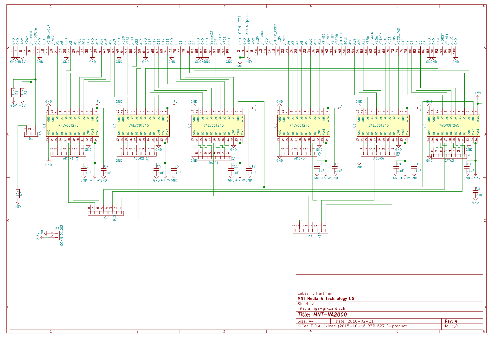

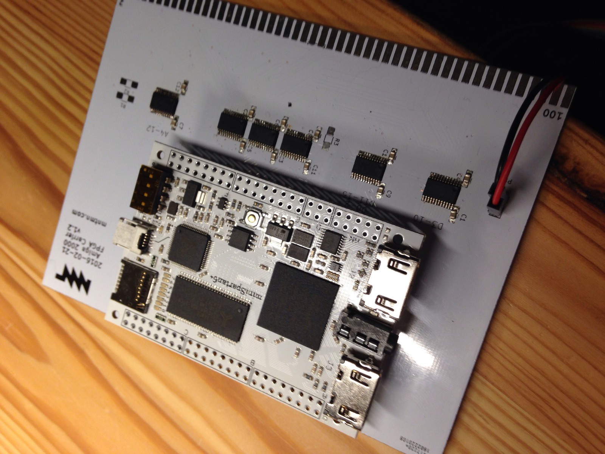

To solve point 2, I ordered a Yihua 853D rework station on Aliexpress and experimented with hot air solder paste soldering (not a success for me, the results were quite messy). I then watched Sparky's super helpful SMD soldering techniques again: https://www.youtube.com/watch?v=z7Tu8NXu5UA

To my surprise, using the "dragging" technique with plenty of flux and a chisel tip (Sparky recommends a "gullwing" tip) at around 270 Celsius yielded the cleanest results I had so far.

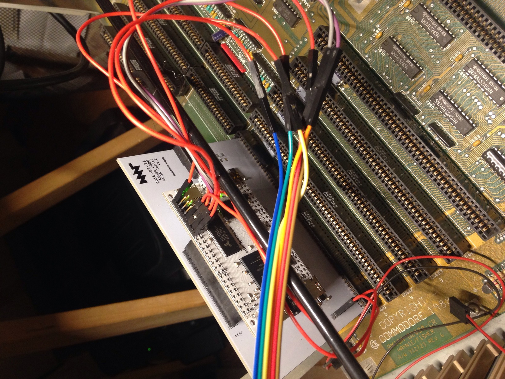

Version 2 rewarded me with super clean signals. I used 5 digital outputs of the FPGA and connected them to a VGA monitor for testing, and I could reliably "lock" my Verilog state machine to the Zorro READ cycles. 

I proceeded to write a little 68k assembler program that reads the Amiga's mouse X and Y registers and translates them into an address for the graphics card to write a pixel to. And voila, I had a primitive painting program:

The main problems I had to solve now revolved around tweaking the state machine so that it would arbitrate the single RAM port between fetching pixels for display on the screen – something that is almost constantly happening, only not during blanking periods – and Amiga reads and writes to and from the graphics RAM. I still haven't completely solved this challenge, but I've come far enough for the system to be somewhat usable. The current algorithm works like this:

### Fetching

Shortly before the beginning of each displayed row, start the pixel _fetching_ process. In this state, a line buffer is normally filled with pixels for that line from SDRAM as fast as possible (133 MHz clock).

### Displaying

The VGA/DVI output process reads the pixels to be displayed from this line buffer at the pixel clock frequency (60~75 MHz for a 1280x720 output). This means that the fetching process always needs to be at least as quick or quicker than the displaying process, or there will be glitches (doubling of the last line).

### Host Writes

When the host CPU wants to write to graphics RAM, we don't let it write directly to the SDRAM (because we're probably currently accessing it for fetches). Instead, we save the host's write address and data to a _write queue_. The queue is drained (processed) whenever the line fetching is done for a row and in blanking periods.

I tested the stability of writes by putting the "mon" tool (http://aminet.net/package/dev/moni/mon165) on a floppy together with a raw 16 bit image (rgb565) of a mountain. I loaded this directly into graphics card memory starting at $600000, displaying the first picture ever on my board:

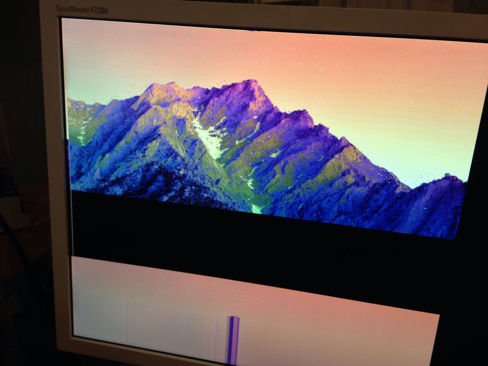

### Host Reads

I found host read timing to be significantly harder to get right, and it's still not perfect. Host reads can't be put in a queue and have to be processed immediately. This interrupts the fetching process; if the host needs to read from a totally different memory location then the display engine is fetching, the SDRAM has to close, refresh and reopen rows, which is a time consuming process. So far, reads from the host cause temporary distortions (glitches) in the display output. I plan to mitigate these problems using either burst mode reads and fast switching and/or inserting CPU wait states via the XRDY signal.

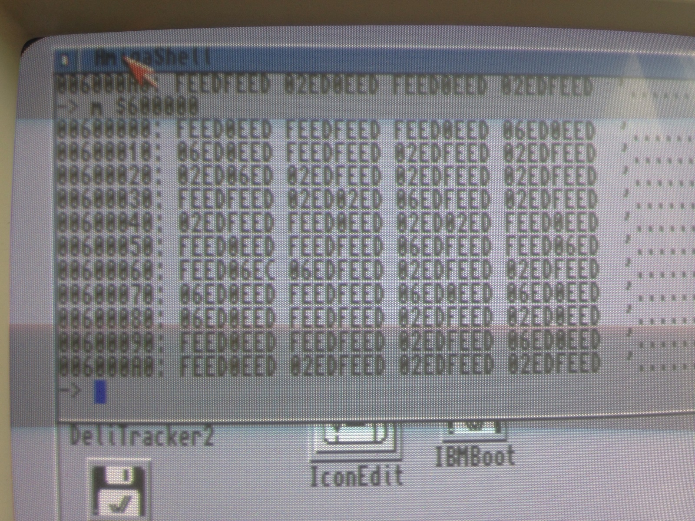
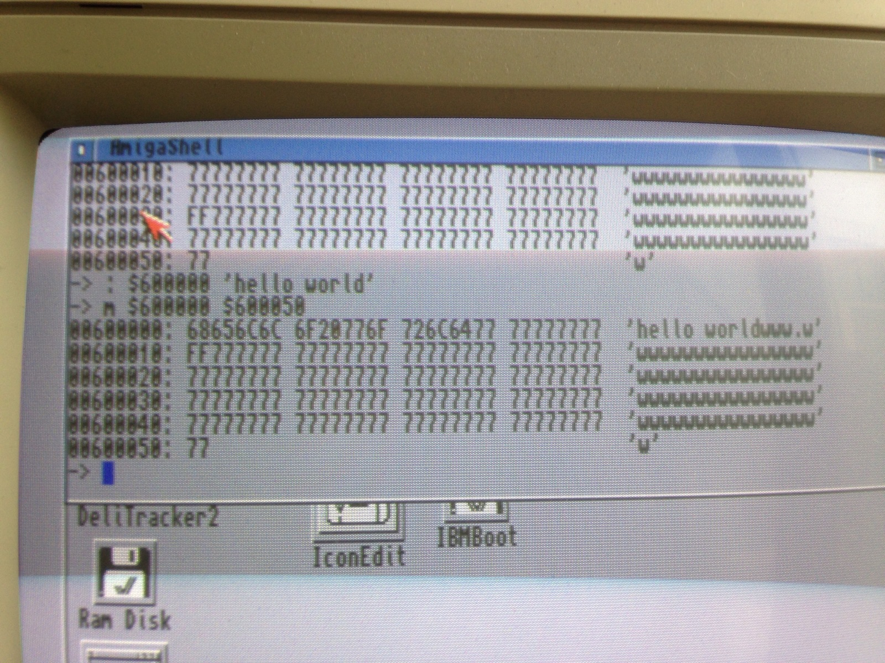

## Picasso96: Writing a Driver for a Closed System

Picasso96 was one of two competing systems (the other being CyberGraphX) integrating graphics cards into the Amiga "Monitor" Device system. P96 also ships an "emulation.library" that patches all system windowing and drawing functions and redirect the legacy bit-planar based output to the new "chunky" pixel formats. After the death of Commodore and the Amiga market, Village Tronic, the authors of P96, disappeared. It's unclear where the sources and internal documentation ended up, and the original developers didn't respond to my emails about it.

I looked at the publically available P96 binaries and documentation and figured that I would need to write a _.card_ file, which is basically a normal Amiga library executable with a different file name extension. From inspecting the binaries and the UAE Picasso96 module, I figured out that my library would have to export a number of function symbols:

- FindCard() to detect if the board is available. I cheated and returned -1 (card found) in d0.
- InitCard(), the most important function, has the job of initializing the board and to fill in a "BoardInfo" structure with details like available pixel color formats, board type, horizontal and vertical maximum resolutions and timings (See: https://github.com/tonioni/WinUAE/blob/master/picasso96.cpp#L1082). This function also stores the addresses of the following callback functions into the BoardInfo structure.

- CalculateBytesPerRow() – Has to return the offset in bytes from one row of pixels to the next. For example: 2048 for a 1024 pixel wide 16-bit display.
- CalculateMemory() – Should remap an address in a1 to another (internal?) address. I just return a1 in d0.
- SetColorArray() – Set the palette for 256 color indexed CLUT mode. I didn't implement this yet.
- ResolvePixelClock() – Supposed to return an index into an array of pixel clocks. Return 0.
- GetPixelClock() – Given an index, return a pixel clock. I just return a fixed number of 60000000.
- SetPanning() – Called when a new P96 screen is opened. In the UAE code, they use it for screen clearing.
- SetSpriteColor() – Just return 0.
- SetDisplay() – enable/disable the display. Just return 0.
- WaitVerticalSync() – Just return 1 or actually sync to the screen refresh process.

Unknown functions: (Stubs that can return 1/0)
- SetSwitch() – Something related to switching between native Amiga and Picasso96 screens.
- SetDAC()
- SetClock()
- GetCompatibleFormats()
- GetVSyncState()
- SetMemoryMode()
- SetWriteMask()
- SetReadPlane()
- SetClearMask()

There is also a number of entrypoints to allow hardware blitting (block copying), rectangle fills and line drawing. I don't implement these yet, but they should speed up working with the card significantly. 

To activate my driver, I had to change the Picasso96 monitor file's "BoardType" tooltype to "VA2000". And indeed, it loaded my VA2000.card without complaining. I then launched the Picasso96Mode application that allows (somewhat erratically) to edit and enable/disable screen modes. To get it to do anything, I copied by trial and error the supplied Picasso96Settings.64 to DEVS:Picasso96Settings and attached the settings to my board that was now showing up in Picasso96Mode's "Board" menu. To my surprise, I could activate the 800x600 mode in "HiColor" and was greeted with a test image and then a somewhat distorted Workbench Screen:

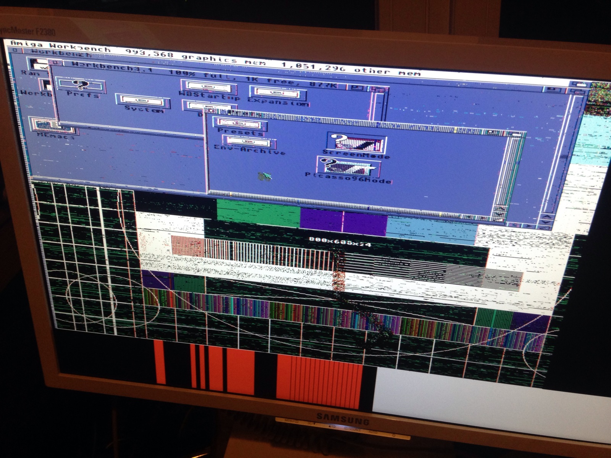

Sprites such as the mouse pointer are emulated in software by Picasso96. In this image you can see some red noisy "turds" from where the mouse pointer was in the frames before – this shows that reading from card memory wasn't working right:

## Fixing the Colors

After playing around with Workbench and several applications, I noticed that somehow I could get only around 64 colors out of the 65535 that should be displayed. This turned out to be a problem of the color format. Picasso96 supports a bunch of 16 bit color modes; for some reasons I had used a "PC" mode (gggrrrrrbbbbbggg) which results in a weird truncation of the color space.

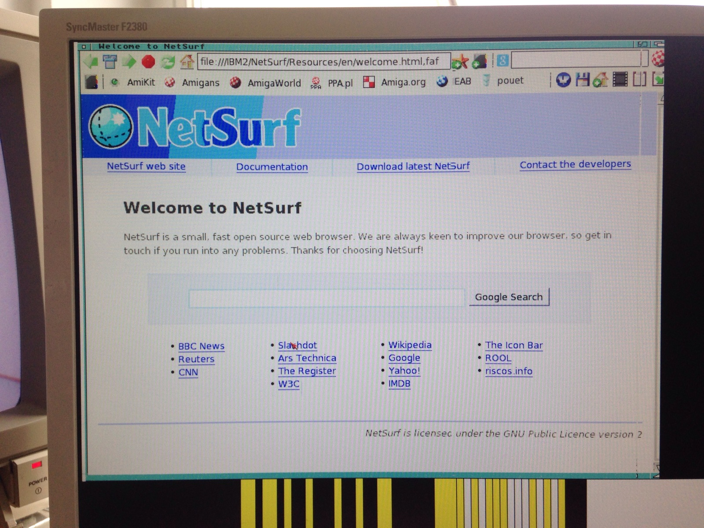
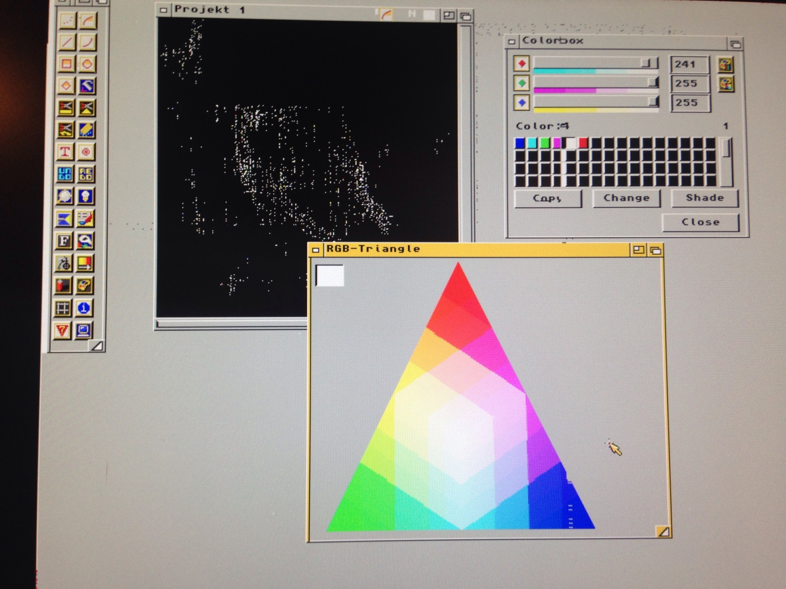

By changing the list of supported color modes in my driver to a non-PC-mode (RGB565), I was able to fix the problem and enjoy "High Color" in 800x600 on my Amiga 2000:

UniView displaying a JPEG (from Hood By Air show):

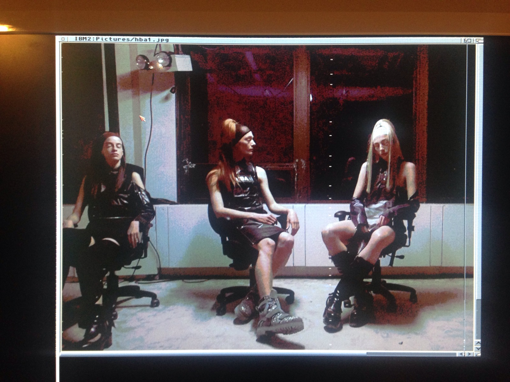

Obligatory shot of Doom:

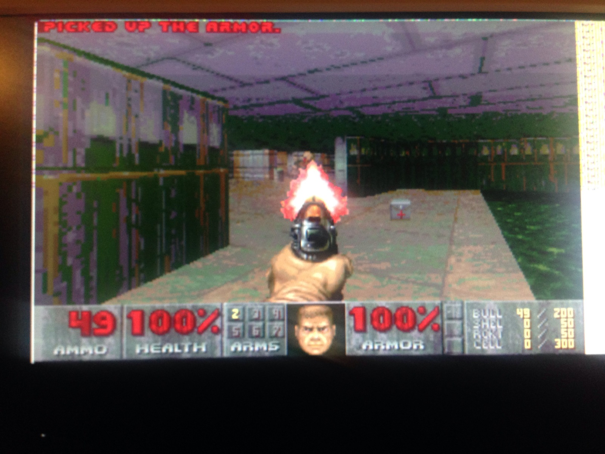

## TODO

I will make one more version of the card supporting a reliable manufacturer's FPGA board and the following improvements. If you have the knowledge / tips on how to tackle any of these, feel free to contact me or submit pull requests:

- Fix the remaining noise in writes/reads
- Wait states via XRDY signal: If READ timing cannot be guaranteed or the WRITE queue is full, the card could ask the host CPU to wait by asserting XRDY, avoiding loss of data.
- Switching resolutions and color modes including true color (24 bit)
- Basic hardware block copy and rect filling support
- Digitizing and scandoubling the native amiga video for HDMI output
- Design a proper metal slot plate for connectors

## How can I build or buy a VA2000 board?

I still have to finish the "release" version of the board including the above fixes. I plan to offer preassembled versions and/or construction kits at reasonable prices. If you want to reserve a board, please send me an email to lukas@mntmn.com including "VA2000" in the subject.

All aspects of the project (schematics, PCB, verilog, driver sources) are or will be published as open source under the MIT license, so you are free to produce your own clones of the board.

## Sources, References, Thanks

Special thanks to Martin Åberg for sharing his "GRETA" Amiga 500 expansion sources (https://github.com/endofexclusive/greta). It inspired me to include bus signal synchronizers and helped with AUTOCONF.

Special thanks to Mike Field, his SDRAM and HDMI sources saved me a lot of time:
- http://hamsterworks.co.nz/mediawiki/index.php/Simple_SDRAM_Controller
- http://hamsterworks.co.nz/mediawiki/index.php/Dvid_test

Amiga Hardware Manual: http://amigadev.elowar.com/read/ADCD_2.1/Hardware_Manual_guide/node0000.html

KiCad Open Source Super Awesome EDA: http://kicad-pcb.org

Thanks to the CommodoreAmiga group on Facebook and thanks to Sebastian Hartmann, Adrian Kaiser, Daniel Zahn, Greta Melnik for inspiration and motivation. Thanks to Jeri Ellsworth for inspiring me to learn Verilog.

Greetings to kipper2k/majsta/BigGun over at the Vampire project!

## Copyright / License

(C)2016 Lukas F. Hartmann (@mntmn) / MNT Media and Technology UG.
http://mntmn.com
https://twitter.com/mntmn

Permission is hereby granted, free of charge, to any person obtaining a copy of this software and associated documentation files (the "Software"), to deal in the Software without restriction, including without limitation the rights to use, copy, modify, merge, publish, distribute, sublicense, and/or sell copies of the Software, and to permit persons to whom the Software is furnished to do so, subject to the following conditions:

The above copyright notice and this permission notice shall be included in all copies or substantial portions of the Software.

THE SOFTWARE IS PROVIDED "AS IS", WITHOUT WARRANTY OF ANY KIND, EXPRESS OR IMPLIED, INCLUDING BUT NOT LIMITED TO THE WARRANTIES OF MERCHANTABILITY, FITNESS FOR A PARTICULAR PURPOSE AND NONINFRINGEMENT. IN NO EVENT SHALL THE AUTHORS OR COPYRIGHT HOLDERS BE LIABLE FOR ANY CLAIM, DAMAGES OR OTHER LIABILITY, WHETHER IN AN ACTION OF CONTRACT, TORT OR OTHERWISE, ARISING FROM, OUT OF OR IN CONNECTION WITH THE SOFTWARE OR THE USE OR OTHER DEALINGS IN THE SOFTWARE.

My dog Tina "helping" me debugging:

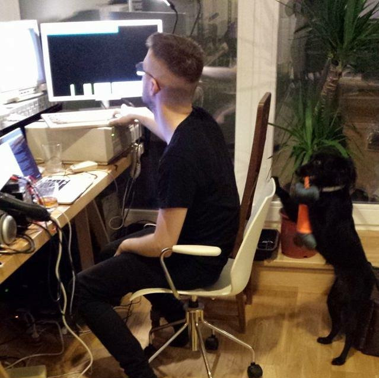
