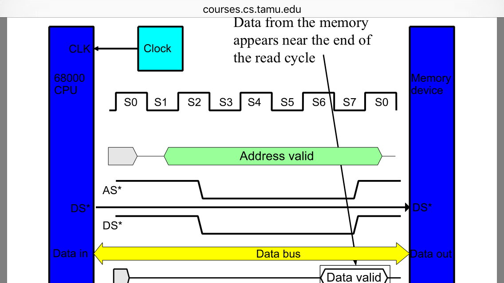
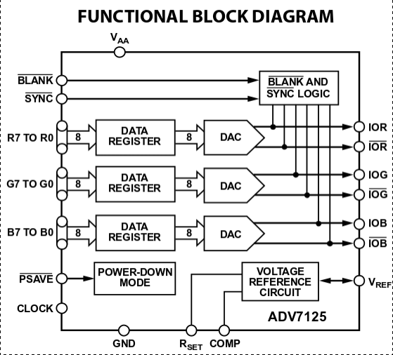
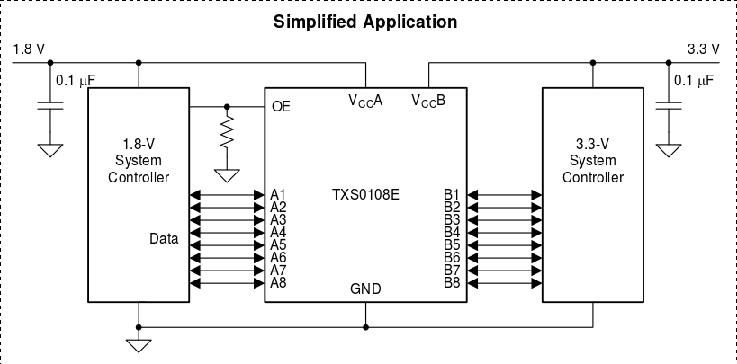
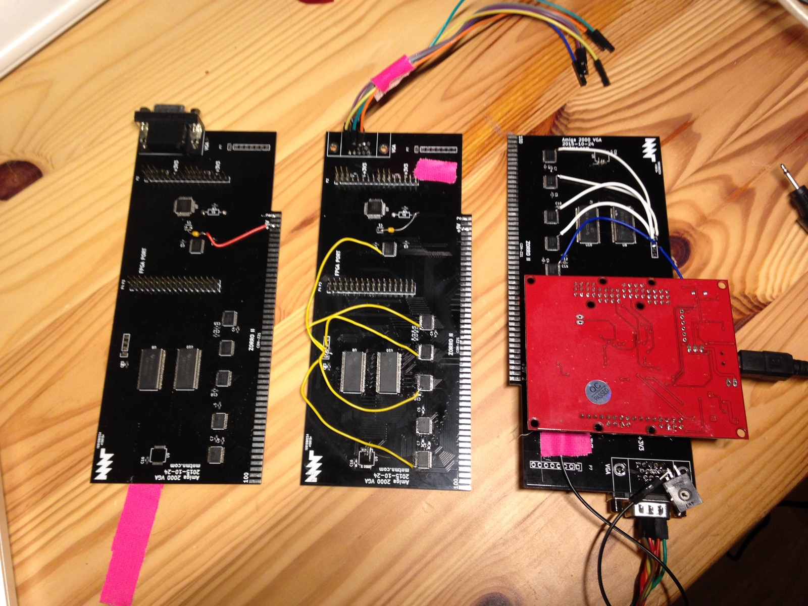
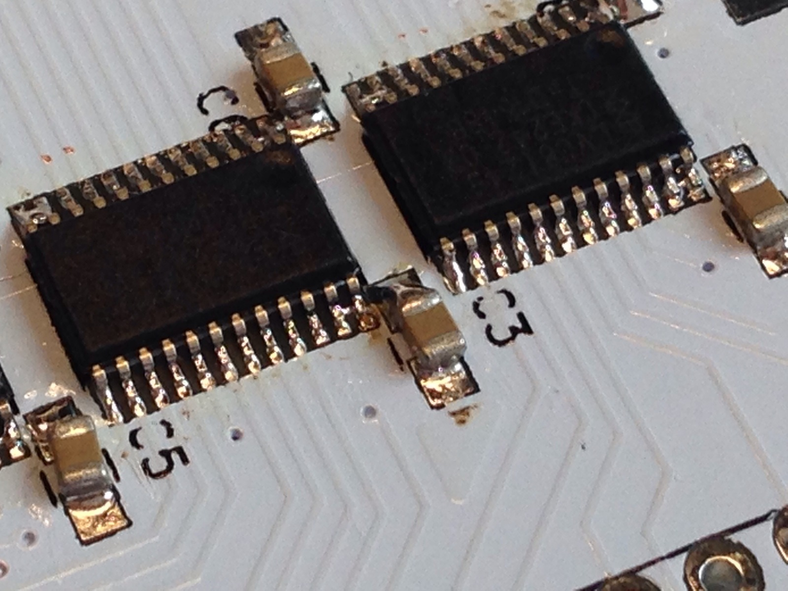
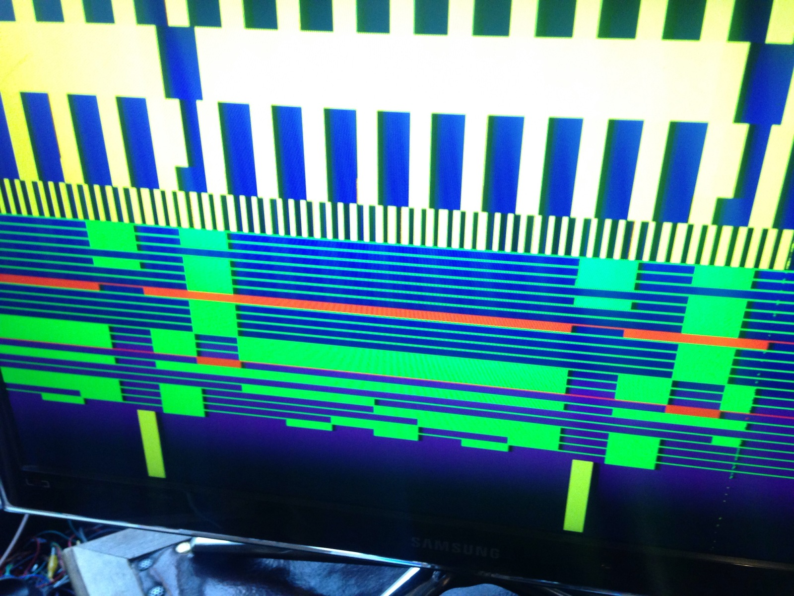
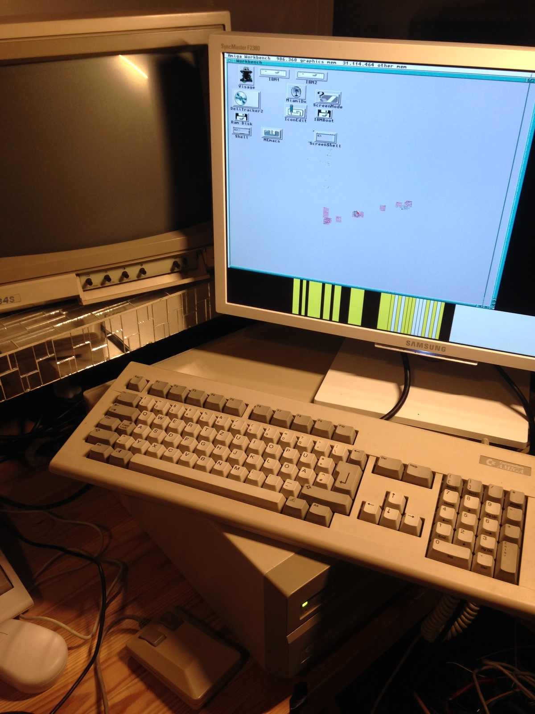
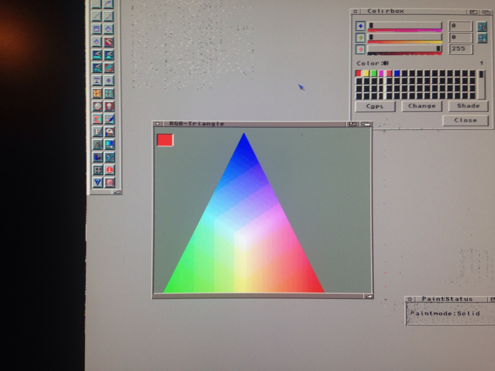

# How I decided to make a graphics card for my Amiga 2000

Somewhere in the middle of 2015 I revived my old A500 and acquired again an A1200, the computer I learned C++ and the basics of web programming on in the late 90s. I also played lots of fantastic Amiga games back in the day, made my first music in ProTracker and my first digital graphics in Deluxe Paint. Re-experiencing the old system that was so ahead of its time again made me curious about Commodore's history and especially about the late, big and ambitious Amiga models (A3000, A4000). This coincided with Amiga's 30th anniversary. A lot of new interviews with the original team(s) popped up, including Dave Haynie, who designed most of the A2000 and the Zorro Bus.

I checked eBay for the "big" Amigas I never had, expecting them to be cheap, but found out that these boxes had turned into valuable collector's items. At the same time, A2000s were (and still are) affordable, so I chose to get one and put a 68040 and a SCSI card in it. But the system couldn't realize it's full potential; in the 90s you could already get, for example, a "Picasso" graphics card that could do VGA (and higher) resolutions at 16 or 24bit color depth. Nowadays, these totally outdated cards are rare and sold for ridiculous prices. My A2000 was stuck with 640x256 PAL resolution, 64 colors (ignoring HAM) or headache-inducing interlaced modes. 

Because of my work with Microcontrollers, writing a low-level OS for Raspberry Pi and my interest in low-level computer architectures in general, I decided in October 2015 in a feat of madness: "I'll just make my own graphics card. How hard can it be?"

It turned out to be a very, very challenging project, but luckily I came much further than I expected. On the way, I had to learn how to design a PCB and get it manufactured, how to work with SMD parts, how to program in Verilog and synthesize code for an FPGA, how SDRAM and DVI/HDMI work (or how to get them to do at least something). I also had to find out how to write a driver for the sadly closed/undocumented Picasso96 "retargetable" graphics stack for AmigaOS 3.

The Amiga is probably the last 32-bit personal computer that is fully understood, documented and hackable. Both its hardware and software contain many gems of engineering and design. I hope that one day, we can have a simple but powerful modern computer that is at the same time as hackable and friendly as the Amiga was.

## The "engine": FPGA and SDRAM

As a platform for my first attempt (ultimately a failure) I chose the Papilio Pro dev board, which has a Xilinx Spartan 6 FPGA and a few megabytes of  SDRAM connected to it. It also has two pin headers that break out some of the general purpose input/output pins of the Spartan. I thought, OK; I could use the RAM to store the image (a framebuffer), and run a loop that goes through all the columns and rows of the picture in the correct speed and just output the bytes from the RAM to R,G and B output lines. I did this before with little Atmel microcontrollers – "bit-banging" a VGA image directly from the CPU – so I knew it was possible. I just didn't know that SDRAM (synchronous dynamic RAM) was a lot more complex to use than the integrated SRAM (static RAM) of common microcontrollers.

I connected an Arduino to the Papilio and used it to send a few address bits and an "on/off" bit to toggle pixels in the framebuffer black or white. This contraption was able to draw basic fonts on my VGA display, and they were successfully kept in the SDRAM. 

The next step was connecting the FPGA+display part to the Amiga 2000.

## Zorro II: Reads and Writes

The original Amiga Hardware Manuals helped me understand the Zorro II bus. It is basically an extension (arbitrated by a bus controller chip) of the pins of the Motorola 68000 CPU. The 68k is extensively studied and documented. I understood that I needed a mechanism that would allow the 68k CPU to write data (pixels) to the graphics card's RAM and another for reading back parts of the screen (for scrolling and moving around things).

So I fired up the open source circuit design tool KiCad and started some schematics. The first task was to define the Zorro port as a component with a whopping 100 pins. Of course I made a lot of little mistakes at first and I had no idea why one would need so many different signals. It turned out that I only needed a subset of the pins to get my job done:

1. Address Bus (A1-A23)
2. Data Bus (D0-D15)
3. Upper and Lower "Data Strobes" (UDS / LDS)
4. READ, /AS, DOE, signals which the Amiga uses to communicate if it wants to read or write, if it presents a valid address and if it expects a device to send data.
5. Power (5V, GND)
6. Autoconf (/CFGIN, /CFGOUT)

I figured that I needed to connect most of these signals to the FPGA and then write another loop in Verilog that would interpret the Amiga's bus commands and act on them (store the data given on the bus in the RAM or return stuff from the RAM). 

On the other side of the FPGA, I decided to place an Analog Devices DAC(XYZ) digital to analog converter chip that would generate the analog R, G and B channels for the VGA port from the bits coming from the framebuffer.

The next hurdle appeared: The Spartan communicate with modern 3.3V logic levels, but the Amiga used legacy 5V signals. So I needed to put voltage translators (also called level shifters) between the Zorro and the FPGA pins. I decided to split the signals into bundles of 8 and use six 8-bit "auto-direction-sensing" TXS0108 chips.

 

## Mistake: Trying to be too smart

I then realized that the Papilio, the FPGA board I had, didn't have enough I/O pins to connect to the 48 Zorro signals and the 16 (?) pins required for the VGA DAC output. Actually, it had a lot less pins. So I made a huge mistake and decided to use two 16-bit port switching chips and "select" on the fly a window of the Zorro pins that would be relevant at each state of my bus communication loop; I thought I didn't need to access the data pins at the same time as the address pins and because the FPGA runs at a much higher frequency than the Zorro bus, I could first read one part of the address, switch one of the switches via a control pin and then quickly read the other part to get the whole address.

 

After drawing up a few versions of the schematics and collecting the fitting footprints for the components from various GitHub repositories, I imported them into KiCad's PCB design tool and started drawing the actual circuit board. I had no experience doing this, so I worked through tutorials or just looked at how other people were solving their board design problems. Finally, I uploaded the exported "Gerber" files to DirtyPCBs.com, ordered, waited 8 weeks and nothing happened. I made the mistake of choosing the AirMail option, which has no tracking, and the package was lost. After getting no support from DirtyPCB, I chose to try again, this time selecting the DHL option with tracking and finally got my first ever printed circuit boards in the mail around 10 days later! By now, it was the middle of January 2016.

In parallel, I ordered the required chips and parts from Mouser; luckily I had gotten most of the footprints right, except for one logic gate IC that turned out to be a mistake anyway. I got to work and tried to solder my first SMD ICs using my trusted ERSA iron. 

 

It turned out I had made a number of critical mistakes in designing the boards: all of the voltage translators' OE pins were tied to GND when they should have had 3.3V, so they required manual bending and patching of the OE leg (yellow cables in the picture). I accidentally switched 3.3V and GND pins on the FPGA carrier headers, so I needed to reroute them with wires on the back. Because I misinterpreted the Multiplexer IC's datasheet, I also planned for a negating Logic IC on their SEL pins which was totaly wrong. In the end I had to solder bridges instead of placing the 74LS04. 

After fighting through all of these issues and burning through a few boards, I finally gut some results. As a first debugging step, I wrote a poor man's logic analyzer in Verilog that would record 640 cycles of all the Zorro Bus signals to FPGA registers (BRAM) and dump them as colorful lines on the VGA screen. This turned out to be a helpful instrument. I wrote a very simple program in 68k assembler for the Amiga that would read – in an endless loop – a word from address $e80000 and write it to $dff180 (a background color register). I made a boot floppy that would run the program, put my card in the A2000, flashed the code and turned everything on.

 

The first 5 longer, stretched rows in this picture are the signals DOE, READ, /UDS, /AS and E7M (Amiga 7Mhz Clock) sampled at 100 Mhz/Column, so the whole picture displays a time sample of 6400ns (nanoseconds) or 6.4ms (milliseconds).

The following lines on the grid represent the Address bits A23-A1 in descending order. A0 does not exist; the 68000 selects an upper, lower or both bytes (word access) using /UDS and /LDS instead.

The address signals have regular little chops in them; this is a nasty side effect of switching the multiplexers. You can also see that address bit A9 is constantly turned on, probably due to a soldering error. At least it's possible to see the 68000's read and subsequent write accesses (the only hole in the READ row, second from the top). Ignoring the broken pins A9 and A17, the READ occurs as expected on address binary 111010000000000000000000 and the WRITE on 0b110111111111000110000000. Due to the constant noise and other random failures, I couldn't reliably get the Amiga to reliably read from my card, but it worked at least sometimes, giving me hope.

After a few nights of trying to fix this very unstable system, I gave up and went back to the drawing board.

## Redesign and Breakthrough

My new strategy was:
1. Make the board much simpler, focus on voltage translation and find a FPGA board with enough IOs
2. Get a decent (de-)soldering station and learn a better SMD soldering technique

To solve point 2, I ordered a Yihua 853D on Aliexpress and experimented with hot air solder paste soldering (not a success for me, the results were quite messy). I then watched Sparky's SMD soldering techniques again: https://www.youtube.com/watch?v=z7Tu8NXu5UA
To my surprise, using the "dragging" technique with plenty of flux and a chisel tip (Sparky recommends a "gullwing" tip) at around 270 Celsius yielded the cleanest results I had so far.

## Picasso96: Writing a Driver

Picasso96 was one of two competing systems (the other being CyberGraphX) integrating graphics cards into the Amiga "Monitor" Device system. P96 also ships an "emulation.library" that patches all system windowing and drawing functions and redirect the legacy bit-planar based output to the new "chunky" pixel formats. After the death of Commodore and the Amiga market, Village Tronic, the authors of P96, disappeared. It's unclear where the sources and internal documentation ended up.

## Fixing READs

## Fixing the Colors

## Problems to solve

- read arbitration
- XRDY (wait states)

## Sources

http://www.alliancememory.com/pdf/dram/256m-as4c16m16s.pdf
http://hamsterworks.co.nz/mediawiki/index.php/Simple_SDRAM_Controller
